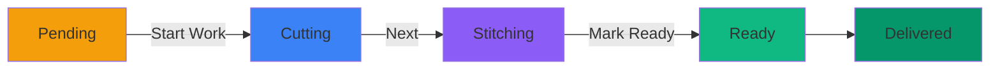

# ✅ Tailor Workflow Feature Complete!

## 🎉 What's New

I've implemented a **complete workflow system** for tailors with proper status progression:

```
Pending → Start Work → Cutting → Next → Stitching → Next/Mark Ready → Ready
```

---

## 📊 Workflow Stages

### 1. **Pending** → Click **"Start Work"** →  **Cutting**
- Tailor clicks "Start Work" button
- Order status changes to "Cutting"
- Order moves to "In Progress" section
- Notifications sent to admin & customer

### 2. **Cutting** → Click **"Next"** → **Stitching**
- Tailor clicks "Next" button
- Order advances to "Stitching" stage
- Still shows in "In Progress" section

### 3. **Stitching** → Click **"Next/Mark Ready"** → **Ready**
- Tailor clicks "Mark Ready" button
- Order status changes to "Ready"
- Order moves to "Completed" section
- Notifications sent to admin & customer

---

## 🎯 Key Features

### ✅ Smart Button Display
- **Pending orders:** Show "Start Work" button (Green)
- **Cutting orders:** Show "Next → Stitching" button (Purple)
- **Stitching orders:** Show "Mark as Ready" button (Green)
- **Ready orders:** No action buttons (completed)

### ✅ Visual Workflow Progress
- Clear progress indicator showing current stage
- Color-coded status badges
- Icons for each stage (Clock → Scissors → T-shirt → Check)

### ✅ Automatic Notifications
- When starting work: Notify admin & customer
- When marking ready: Notify admin & customer
- High-priority notifications for completed orders

### ✅ In-Progress Tracking
- Orders in "Cutting" or "Stitching" show as "In Progress"
- Easy filtering by status
- Auto-refresh every 30 seconds

---

## 🚀 How It Works

### For Tailors:

#### Step 1: View Orders
1. Login to tailor dashboard
2. See list of assigned orders
3. Orders show current status and appropriate buttons

#### Step 2: Start Working
1. Find a **Pending** order
2. Click **"Start Work"** button (or **"View Details"** → **"Start Work"**)
3. Order moves to **Cutting** stage
4. Admin & customer get notified

#### Step 3: Advance Through Stages
1. Order in **Cutting** → Click **"Next → Stitching"**
2. Order in **Stitching** → Click **"Mark as Ready"**
3. Each transition updates the order status

#### Step 4: Complete Order
1. When in "Stitching", click **"Mark as Ready"**
2. Order status becomes **"Ready"**
3. Admin & customer get high-priority notifications
4. Order moves to completed section

---

## 📱 User Interface

### Orders List View:
```
┌─────────────────────────────────────────────────────┐
│ Order #ABC123  │ Status: Cutting  │  Actions:       │
│ Customer       │ Item: Kurta      │  [View] [Next→] │
├─────────────────────────────────────────────────────┤
│ Order #DEF456  │ Status: Pending  │  Actions:       │
│ Customer       │ Item: Lehenga    │  [View] [Start] │
└─────────────────────────────────────────────────────┘
```

### Order Details View:
```
┌───────────────────────────────────────────────┐
│         WORKFLOW PROGRESS                     │
│  ⭕ Pending → ✅ Cutting → ⭕ Stitching → ⭕ Ready  │
├───────────────────────────────────────────────┤
│          [Next → Stitching]                   │
│         (Big Purple Button)                   │
├───────────────────────────────────────────────┤
│  Customer Info | Order Details | Timeline     │
│  Measurements  | Special Instructions         │
└───────────────────────────────────────────────┘
```

---

## 🔧 Technical Implementation

### Backend

#### New Endpoint: `/api/orders/:id/next-stage`

**Request:**
```http
PUT /api/orders/{orderId}/next-stage
Authorization: Bearer {tailor-token}
```

**Response:**
```json
{
  "success": true,
  "message": "Status updated: Cutting → Stitching",
  "order": { ... },
  "previousStatus": "Cutting",
  "currentStatus": "Stitching"
}
```

**Status Flow Map:**
```javascript
{
  'Pending': 'Cutting',
  'Order Placed': 'Cutting',
  'Cutting': 'Stitching',
  'Stitching': 'Ready',
  'Trial': 'Ready'
}
```

#### Updated Endpoints:
1. **`/api/orders/:id/start-work`** - Start working (Pending → Cutting)
2. **`/api/orders/:id/next-stage`** - Advance to next stage
3. **`/api/orders/:id/mark-ready`** - Direct mark as ready (backup)

### Frontend

#### New Page: `/tailor/orders/:id`

**Features:**
- Visual workflow progress indicator
- Big action buttons for current stage
- Complete order details display
- Customer info (name, phone)
- Measurements display
- Timeline information

#### Updated Components:
1. **AllOrders.js** - Shows workflow buttons in list
2. **OrderDetails.js** - Dedicated order detail page
3. **TailorDashboard.js** - Shows orders by status

---

## 📁 Files Created/Modified

### Backend:
1. ✅ **`backend/routes/orders.js`**
   - Added `/next-stage` endpoint
   - Enhanced notification logic

### Frontend:
2. ✅ **`frontend/src/pages/tailor/Orders/OrderDetails.js`** - NEW
   - Complete order details view
   - Workflow progress indicator
   - Action buttons based on status

3. ✅ **`frontend/src/pages/tailor/Orders/OrderDetails.css`** - NEW
   - Beautiful UI styling
   - Responsive design
   - Workflow animations

4. ✅ **`frontend/src/pages/tailor/Orders/AllOrders.js`**
   - Added workflow action buttons
   - `handleStartWork()` function
   - `handleNextStage()` function

---

## 🧪 Testing

### Test the Complete Workflow:

#### 1. Login as Tailor
```
Email: tailor@gmail.com
Password: tailor123
```

#### 2. Find a Pending Order
- Go to Orders list
- Look for orders with "Pending" status
- Click "Start Work" button

#### 3. Advance Through Stages
- Order should now show "Cutting" status
- Click "Next → Stitching" button
- Order should now show "Stitching" status
- Click "Mark as Ready" button
- Order should now show "Ready" status

#### 4. Verify Notifications
- Login as Admin
- Check for notifications about:
  - "tailor started working on Order #XYZ"
  - "Order #XYZ completed - Ready for delivery!"

---

## 📊 Status Progression Map



---

## 🎨 Button Colors

| Status | Button Text | Color | Icon |
|--------|------------|-------|------|
| Pending | "Start Work" | Green (#10b981) | ▶️ Play |
| Cutting | "Next → Stitching" | Purple (#8b5cf6) | → Arrow |
| Stitching | "Mark as Ready" | Green (#10b981) | ✓ Check |
| Ready | (No button) | - | - |

---

## 🔔 Notification Details

### When Starting Work (Pending → Cutting):
- **Admin:** "🔨 tailor started working on Order #XYZ (Kurta)"
- **Customer:** "✂️ Great news! Your order #XYZ is now being worked on!"

### When Marking Ready (Stitching → Ready):
- **Admin:** "✅ Order #XYZ completed by tailor - Ready for delivery!"
- **Customer:** "🎉 Exciting news! Your Kurta (Order #XYZ) is ready for collection!"

---

## 💡 Benefits

### For Tailors:
✅ Clear workflow progression
✅ One-click status updates
✅ Visual progress tracking
✅ No confusion about next steps

### For Admins:
✅ Real-time updates on order progress
✅ Automatic notifications
✅ Easy tracking of workload

### For Customers:
✅ Know when work starts
✅ Know when order is ready
✅ Better communication

---

## 🎯 Usage Example

```
Day 1 (Morning):
- Admin assigns Order #ABC123 to tailor
- Tailor sees order in "Pending" list
- Tailor clicks "Start Work"
- Status: Pending → Cutting
- Admin & Customer get notified

Day 1 (Afternoon):
- Tailor finishes cutting
- Tailor clicks "Next → Stitching"
- Status: Cutting → Stitching
- Order still shows in "In Progress"

Day 2 (Morning):
- Tailor finishes stitching
- Tailor clicks "Mark as Ready"
- Status: Stitching → Ready
- Admin & Customer get "Ready!" notifications
- Order moves to "Completed" section
```

---

## 📋 Quick Reference

### API Endpoints:
```
PUT /api/orders/:id/start-work    # Start working
PUT /api/orders/:id/next-stage     # Advance stage
PUT /api/orders/:id/mark-ready     # Mark as ready
GET /api/orders/assigned           # Get tailor's orders
```

### Frontend Routes:
```
/dashboard/tailor                  # Dashboard
/dashboard/tailor/orders           # All orders list
/dashboard/tailor/orders/:id       # Order details
```

### Key Functions:
```javascript
handleStartWork(orderId)   // Start work on order
handleNextStage(orderId)   // Advance to next stage
fetchOrders()              // Refresh orders list
```

---

## ✅ Checklist

- [x] Backend endpoint for status progression
- [x] Start Work functionality
- [x] Next Stage functionality
- [x] Mark Ready functionality
- [x] Notifications on transitions
- [x] Order Details page created
- [x] Workflow progress indicator
- [x] Action buttons in orders list
- [x] Color-coded status badges
- [x] Auto-refresh dashboard
- [x] Documentation complete

---

## 🚀 Ready to Use!

The complete tailor workflow is now implemented and ready to use!

**Next Steps:**
1. Start your backend server
2. Start your frontend server
3. Login as tailor
4. Try the workflow on a pending order

---

**Status:** ✅ **COMPLETE & READY**  
**Date:** October 25, 2025  
**Feature:** Complete Tailor Workflow with Status Progression  
**Result:** Seamless workflow from Pending → Ready! 🎉

